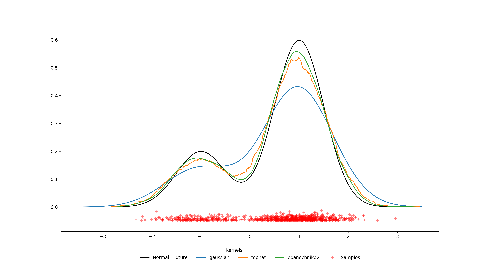

[](http://quantlet.de/)

## [](http://quantlet.de/) **DEDA_StatisticsFinance** [](http://quantlet.de/)

```yaml

Name of Quantlet : DEDA_StatisticsFinance
Published in : Digital Economy and Decision Analytics
Description :
- Demonstrate Linear Opearation and Fourier Transform Using Nympy
- Draw plot normal distributed random variables and sample's PDF and CDF using Matplotlib
- Demonstrate different kernel density estimations
- Use Black-Scholes Model to price options
- Simulate implied volatility and plot volatility smile

Keywords :
- Python
- Teaching
- Numpy
- Scipy
- Matplotlib
- PDF/CDF
- KDE
- Black-Scholes
- Implied Volatility

Author : Junjie Hu, Yves Hilpisch, Justin Hellermann

```





### PYTHON Code
```python

import numpy as np
from scipy import stats
import statsmodels.api as sm
import matplotlib.pyplot as plt
from statsmodels.distributions.mixture_rvs import mixture_rvs
from sklearn.neighbors import KernelDensity
from scipy.stats import norm

np.random.seed(12345)

# specify mu sigma and weight for both distributions
dist1_loc, dist1_scale, weight1 = -1 , .5, .25
dist2_loc, dist2_scale, weight2 = 1 , .5, .75

N = 1000
# Sample from a mixture of distribution

obs_dist1 = np.random.normal(loc=dist1_loc,
							scale=dist1_scale,
							size=int(N*weight1))

obs_dist2 = np.random.normal(loc=dist2_loc,
							scale=dist2_scale,
							size=int(N*weight2))

obs_dist = np.concatenate([obs_dist1,obs_dist2],axis=0)
fig = plt.figure(figsize=(15, 8))
ax = fig.add_subplot(111)

# Scatter plot of data samples and histogram

ax.scatter(obs_dist, np.abs(np.random.randn(obs_dist.shape[0]))/100-0.05,
            zorder=15, color='red', marker='+', alpha=0.5, label='Samples')

X_plot = np.linspace(-3.5, 3.5, 1000)
norm_linear = (0.25 * norm(-1, .5).pdf(X_plot) + 0.75 * norm(1, .5).pdf(X_plot))
ax.plot(X_plot, norm_linear, c='black', label='Normal Mixture')

# Create linear combination of 2 normal distributed random variable
# Use 3 different kernel to estimate
for kernel in ['gaussian', 'tophat', 'epanechnikov']:
    # Initial an object to use kernel function to fit data, bandwidth will affect the result
    kde = KernelDensity(kernel=kernel, bandwidth=0.5).fit(obs_dist.reshape(-1, 1))
    # Evaluate the density model on the data
    log_dens = kde.score_samples(X_plot.reshape(-1, 1))
    ax.plot(X_plot, np.exp(log_dens), '-', label=str(kernel))


# Add text on the plot, position argument can be arbitrary
#ax.set_xlabel("N={0} points".format(N))
ax.text(-0.5, -0.16,'Kernels')
ax.legend(loc='upper center', bbox_to_anchor=(0.5, -0.1),
          fancybox=True, shadow=False, ncol=5,frameon=False)

ax.spines['top'].set_visible(False)
ax.spines['right'].set_visible(False)
# Set x-axis y-axis limit to adjust the figure
fig.savefig('kde.png', dpi=500,transparent=True
	)
plt.show()


```

automatically created on 2020-05-11